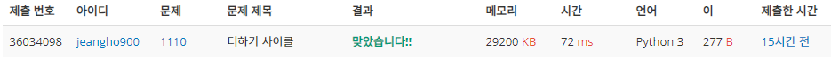

# 풀이 :notebook:

문제 링크 : https://www.acmicpc.net/problem/1110

난이도 : __브론즈 1__

## 요점

- `while문`을 활용한 문제 풀이
- 주어진 수가 0~9의 범위에 있을 때, 0을 앞에 붙인다.
- `if문`으로 roof break는 문자열 비교

## 풀이

```python
n = input()

# 만약 주어진 수가 0~9일 경우, 0을 덧붙인다.
if len(n) == 1:
    n = '0' + n

temp, cnt = n, 0  # 원래의 숫자를 임시 저장, 사이클 횟수 선언
while True:
    first_number = n[-1]  # 2번째 자릿수
    second_number = str(int(n[0]) + int(n[1]))  # 1번째 자릿수
    n = first_number + second_number[-1]  # 결과
    cnt += 1
    if temp == n:
        print(cnt)
        break
```

## 실행 결과

